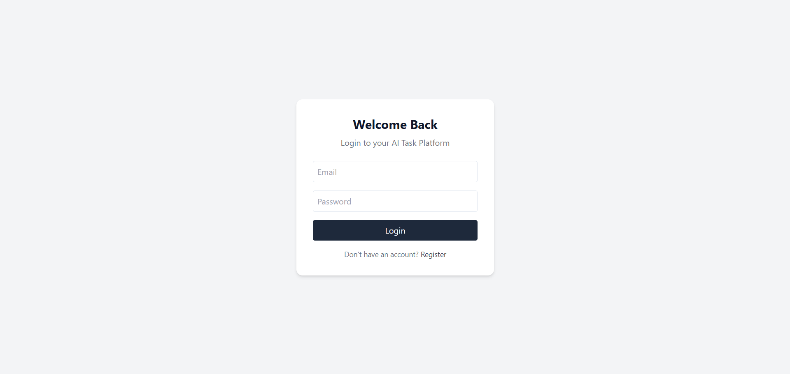
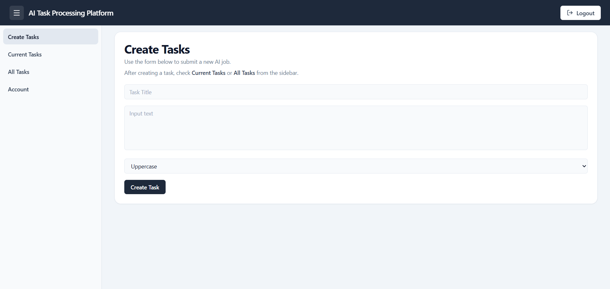
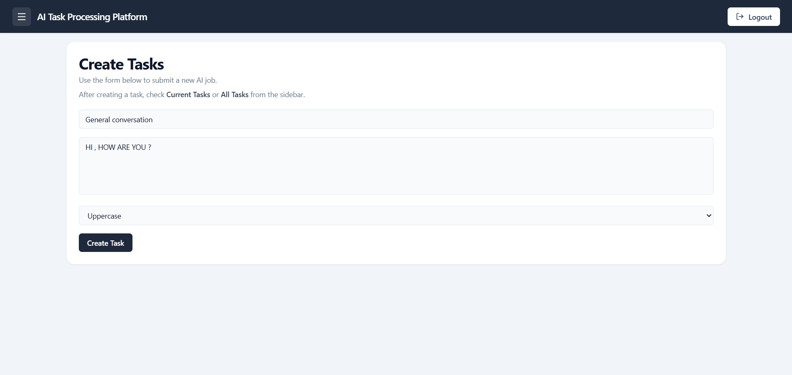
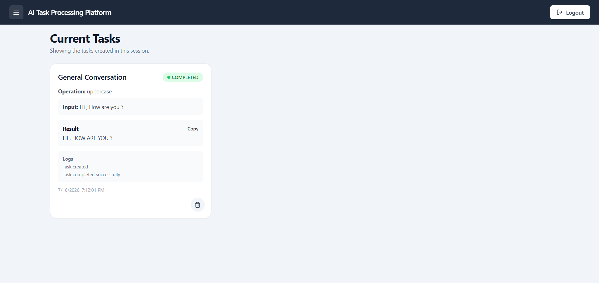
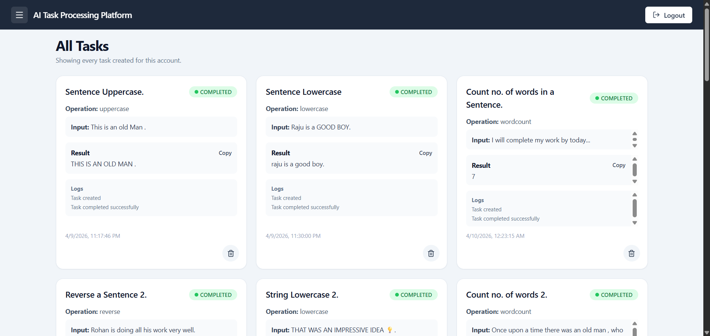

# AI Task Processing Platform


A distributed platform for processing text "AI tasks" asynchronously using a MERN-style stack + a Python worker.

## Features

* User registration & login (JWT)
* Create tasks (uppercase, lowercase, reverse, word count)
* Dashboard organized into `Create Tasks`, `Current Tasks`, `All Tasks`, and `Account`
* Async processing via Redis queue + Python worker
* Task status + results in MongoDB

---

## Live Deployment

* **Frontend (React UI)**
  https://ai-task-processing-platform.vercel.app/

* **Backend API**
  https://ai-task-processing-platform.onrender.com

* **Worker Service**
  https://ai-task-processing-platform-1.onrender.com  

---

## Architecture

* Frontend: React (Vite) served by Nginx
* Backend: Node.js + Express API
* Worker: Python background processor
* Queue: Redis (task queue)
* DB: MongoDB (tasks/users)
* Deploy: Docker Compose (local) + Kubernetes (GitOps via Argo CD)
* CI/CD: GitHub Actions builds/pushes images and updates infra repo image tags

Architecture: React + Node.js + Redis Queue + Python Worker + MongoDB Atlas deployed on Render & Vercel

**Note:** The worker service is periodically pinged using UptimeRobot to prevent cold starts on free-tier hosting.

---

## System Flow

```
User → React Frontend
     → Node.js API
     → MongoDB (task stored as pending)
     → Redis Queue
     → Python Worker processes task
     → MongoDB updated with result
     → Frontend auto-refresh displays result
```

---

## Project Structure

* `frontend/` → React UI
* `backend/` → Node.js API
* `worker/` → Python worker
* `infrastructure/docker/` → Docker Compose for local dev
* `infrastructure/argocd/` → Argo CD Application manifest (points to infra repo)
* `scripts/` → automation scripts (CI helper)
* `docs/` → documentation

---

## Screenshots

### Login



### Dashboard



### Task Creation



### Current Tasks



### All Tasks



---

## Local Setup

### Prerequisites

* Node.js 18+ and npm
* Python 3.10+
* MongoDB connection string
* Redis connection string

### Option 1: Run locally without Docker

1. Install frontend dependencies:

```sh
cd frontend
npm install
```

2. Install backend dependencies:

```sh
cd ../backend
npm install
```

3. Install worker dependencies:

```sh
cd ../worker
pip install -r requirements.txt
```

4. Set environment variables:

```sh
copy .env.example backend\.env
```

Create `worker\.env` as well and add `MONGO_URI` and `REDIS_URL` there.

Add your own values for `MONGO_URI`, `JWT_SECRET`, and `REDIS_URL` in the backend env file.

5. Start the backend:

```sh
cd backend
npm start
```

6. Start the worker:

```sh
cd worker
python worker.py
```

7. Start the frontend:

```sh
cd frontend
npm run dev
```

### Option 2: Run with Docker Compose

From repo root:

```sh
docker compose -f infrastructure/docker/docker-compose.yml up --build
```

This starts the frontend, backend, worker, MongoDB, and Redis containers together.

---

## Kubernetes Deployment

This project uses **two repos** for GitOps:

* App repo (this): builds Docker images
* Infra repo: stores Kubernetes manifests (`base/` + `overlays/`) consumed by Argo CD

### 1) Install ingress controller (Docker Desktop Kubernetes)

```sh
kubectl apply -f https://raw.githubusercontent.com/kubernetes/ingress-nginx/controller-v1.12.1/deploy/static/provider/cloud/deploy.yaml
```

### 2) Install Argo CD

```sh
kubectl create namespace argocd
kubectl apply -n argocd -f https://raw.githubusercontent.com/argoproj/argo-cd/stable/manifests/install.yaml
```

### 3) Create required Kubernetes Secret

Backend expects:

* Secret name: `ai-platform-secrets`
* Key: `JWT_SECRET`

```sh
kubectl -n ai-task-processing-platform create secret generic ai-platform-secrets \
  --from-literal=JWT_SECRET='replace-with-strong-random-string'
```

### 4) Create Argo CD Application

Update `infrastructure/argocd/application.yml` to point to your infra repo and the correct overlay path, then apply:

```sh
kubectl apply -f infrastructure/argocd/application.yml
```

### 5) Access Argo CD UI (local)

```sh
kubectl -n argocd port-forward svc/argocd-server 8090:443
```

Open `https://localhost:8090` (self-signed cert warning is expected).

### 6) Access the app (local)

If using ingress-nginx on Docker Desktop, port-forward the ingress controller:

```sh
kubectl -n ingress-nginx port-forward svc/ingress-nginx-controller 8080:80
```

Add hosts entry:

* `127.0.0.1 ai-task-processing-platform.local`

Open:

* `http://ai-task-processing-platform.local:8080`

---

## CI/CD

GitHub Actions:

* lints frontend
* builds & pushes Docker images to Docker Hub
* auto-updates image tags in the infra repo (kustomize overlays)

Required GitHub Actions secrets (app repo):

* `DOCKER_USERNAME`
* `DOCKER_PASSWORD` (Docker Hub access token recommended)
* `INFRA_REPO` (e.g. `Ritik-Gswmi/ai-task-processing-platform-infra`)
* `INFRA_REPO_TOKEN` (GitHub PAT with write access to infra repo)

---

## Author

Ritik Kumar
